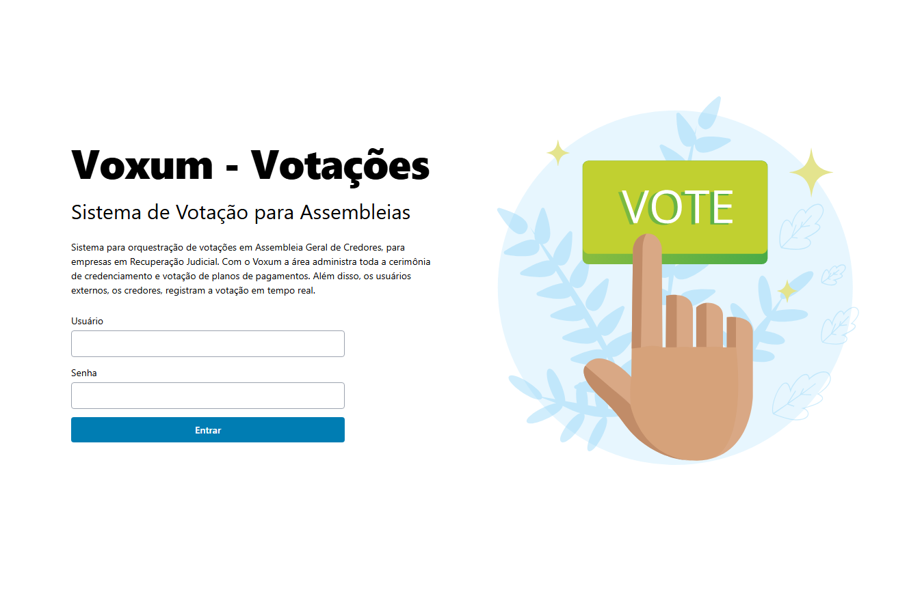
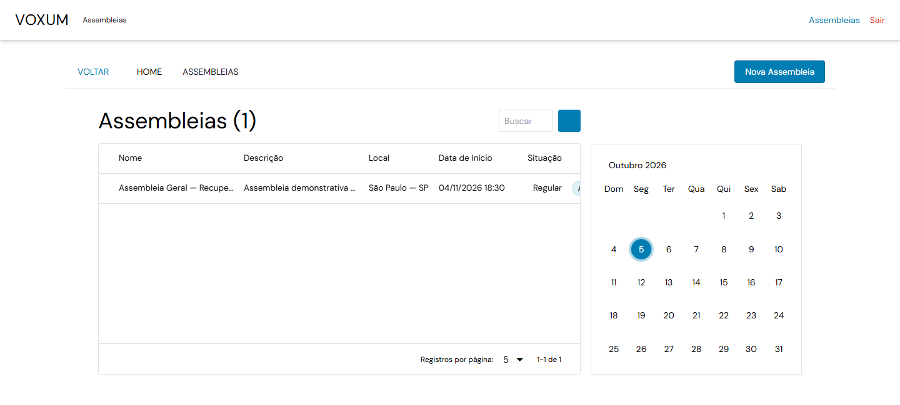
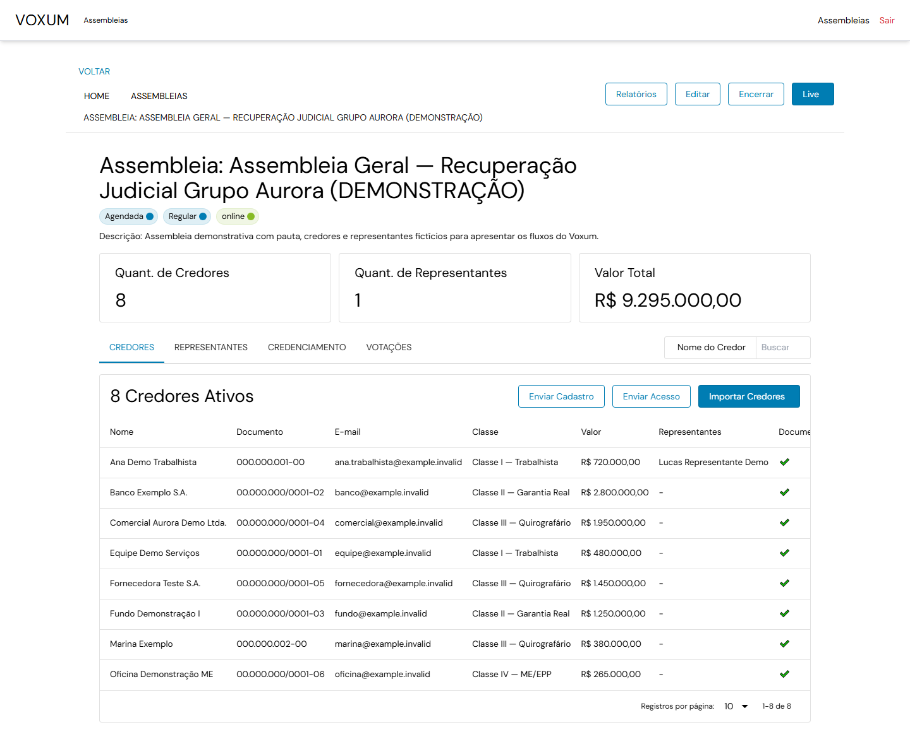
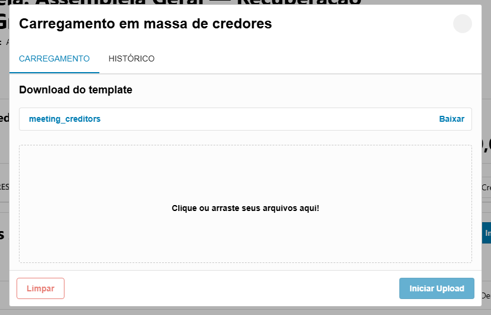
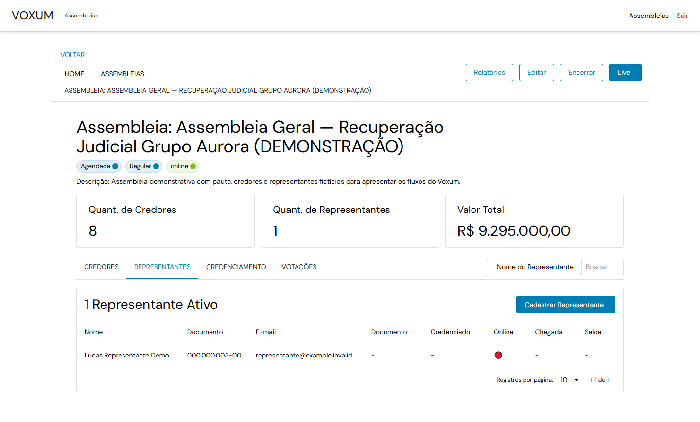
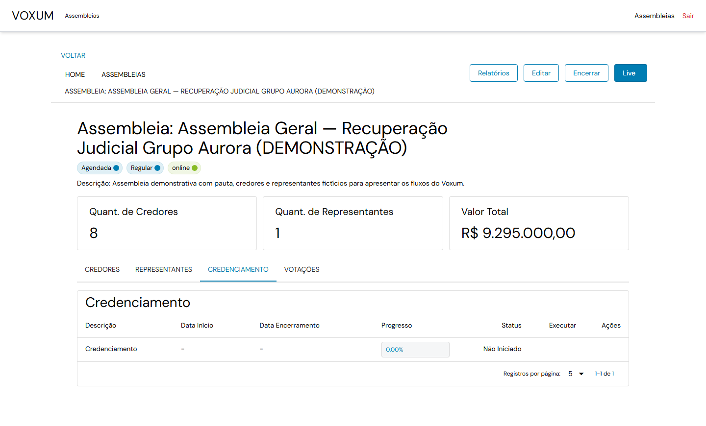
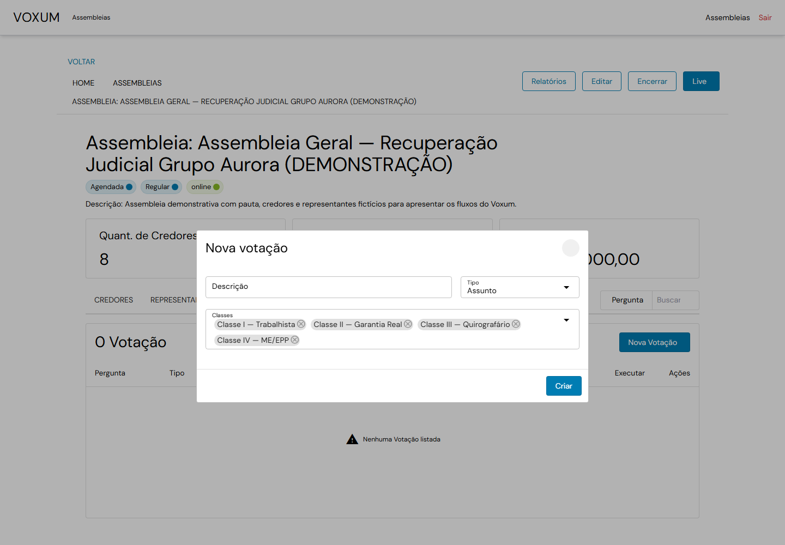
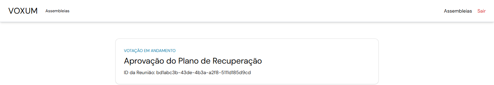

# Voxum

**Assembleias de credores, do credenciamento à votação, em uma única plataforma.**

O Voxum apoia a gestão de Assembleias Gerais de Credores (AGCs): organiza participantes e presença, conduz votações e facilita a consulta de resultados. O sistema reúne uma aplicação web em Vue e uma API em Django, com atualizações em tempo real.

[](./frontend/package.json)
[](./backend/requirements.txt)

## Visão do produto

### Entrada da plataforma



### Lista de assembleias



### Detalhes da assembleia e credores



### Importação de credores



### Representantes e credenciamento





### Configuração de votação



### Tela de votação



## O que a plataforma oferece

- Cadastro e gestão de assembleias, credores, representantes, convidados e localidades.
- Credenciamento, acompanhamento de presença e quórum.
- Configuração de pautas e condução de votações por credor ou representante.
- Consulta de resultados e geração de relatórios.
- Acesso de convidados e atualização de eventos em tempo real via WebSocket.
- Documentação interativa da API com Swagger e ReDoc.

## Tecnologias

| Camada | Tecnologias |
| --- | --- |
| Interface web | Vue 3, Vite, Quasar, UnoCSS, Vue Router e Axios |
| API e tempo real | Python, Django, Django REST Framework, Django Channels e Daphne |
| Processamento | Celery e Redis em configurações não locais; SQLite e execução local simplificada para desenvolvimento |

As dependências declaradas estão em [frontend/package.json](./frontend/package.json) e [backend/requirements.txt](./backend/requirements.txt).

## Estrutura

```text
.
├── backend/
│   ├── apps/          # Assembleias, credores, presença, votação, relatórios e mais
│   ├── config/        # Configurações Django, URLs e ASGI
│   ├── core/          # Usuários e permissões
│   └── swagger.json   # Snapshot da especificação da API
└── frontend/
    └── src/
        ├── pages/     # Gestão, assembleia, votação e acesso de convidados
        ├── components/
        └── services/  # Integração HTTP com a API
```

## Executar localmente

### Requisitos

- Python 3.10 ou superior
- Node.js 18 ou superior e npm
- Git

### 1. Inicie a API

No PowerShell, a partir da raiz do repositório:

```powershell
cd backend
py -m venv .venv
.\.venv\Scripts\Activate.ps1
python -m pip install --upgrade pip
pip install -r requirements.txt
python manage.py migrate
python manage.py create_voxum_groups
python manage.py createsuperuser
python manage.py runserver
```

Crie suas próprias credenciais quando solicitado. Não há conta ou senha de demonstração incluída. A configuração local usa SQLite, cache local e camada de canais em memória; não exige Redis nem worker Celery para a execução básica.

### 2. Inicie a aplicação web

Em outro terminal, na raiz do repositório:

```powershell
cd frontend
npm install
npm run dev:local
```

Abra o endereço informado pelo Vite. A navegação do frontend usa a base `/voxum/`. O modo local encaminha as chamadas `/voxum/api` e `/voxum/ws` para `http://127.0.0.1:8000`; se a API estiver em outro endereço, ajuste o proxy em [frontend/vite.config.js](./frontend/vite.config.js). O HTTPS está habilitado por padrão; use `VITE_HTTPS=false` para desenvolvimento em HTTP.

## API e WebSockets

Com a API em execução, a documentação interativa está disponível em:

- Swagger UI: [`/voxum/api/v1/docs/`](http://127.0.0.1:8000/voxum/api/v1/docs/)
- ReDoc: [`/voxum/api/v1/docs/redoc/`](http://127.0.0.1:8000/voxum/api/v1/docs/redoc/)
- Esquema JSON: [`/voxum/api/v1/docs.json`](http://127.0.0.1:8000/voxum/api/v1/docs.json)
- Snapshot OpenAPI: [backend/swagger.json](./backend/swagger.json)

O prefixo REST local é `/voxum/api/v1/`. Os WebSockets usam `/voxum/ws/V1/`, com canais para assembleias, convidados e eventos gerais.

## Configuração

Os valores de ambiente são definidos em `backend/config/` e nos arquivos `.env` locais do frontend. Entre as configurações do backend estão `ENVIRONMENT`, `DEBUG`, `SECRET_KEY`, `APP_NAME`, `BASE_API_URL`, as variáveis `DB_*`, `REDIS_URL`, `FERNET_KEY` e as opções de integração `MSAL_CIAM_*`.

Os padrões locais servem para desenvolvimento. Ambientes implantados precisam de segredos próprios e configuração adequada de banco de dados, cache, Redis, filas, HTTPS, hosts e permissões. Não publique tokens, senhas ou chaves no repositório.

## Verificações

Execute os comandos a partir do diretório indicado:

```powershell
# backend/
python manage.py check
python manage.py test apps.voxum_base.tests
```

```powershell
# frontend/
npm run lint
npm run build
```

## Documentação dos módulos

Consulte também o [README do backend](./backend/README.md), a [visão da estrutura do backend](./backend/README_DOCS.md) e os READMEs mantidos junto aos módulos em `backend/apps/` e `backend/core/`.
